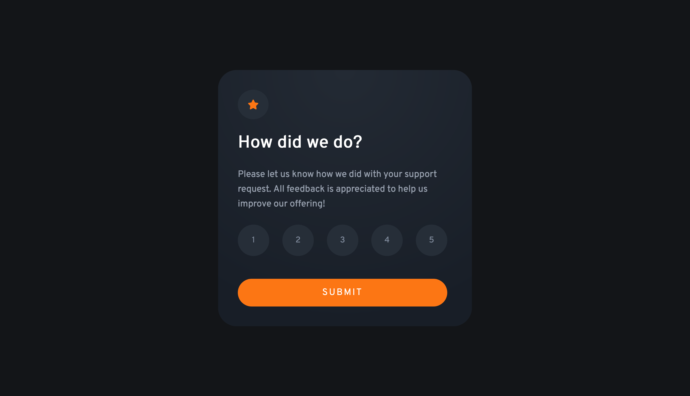

# Frontend Mentor - Interactive rating component solution

This is a solution to the [Interactive rating component challenge on Frontend Mentor](https://www.frontendmentor.io/challenges/interactive-rating-component-koxpeBUmI).
## Table of contents

- [Overview](#overview)
  - [The challenge](#the-challenge)
  - [Screenshot](#screenshot)
  - [Link](#link)
- [My process](#my-process)
  - [Built with](#built-with)
  - [Continued development](#continued-development)
- [Author](#author)

## Overview

### The challenge

Users should be able to:

- View the optimal layout for the app depending on their device's screen size
- See hover states for all interactive elements on the page
- Select and submit a number rating
- See the "Thank you" card state after submitting a rating

### Screenshot

### Link

- Live Site URL: [Click here](https://antonistarzynski.github.io/Interactive-Rating-Component-by-frontendmentor/)

## My process

### Built with

- Semantic HTML5 markup
- Sass
- Flexbox
- Java Script (DOM & simple logic)

### Continued development

I want to dig deeper into Sass to use it with more freedom and organize style sheets with more clarity and usablity.

## Author

- Website - [Antek Starzynski](https://www.antekstarzynski.com)
- Frontend Mentor - [@antonistarzynski](https://www.frontendmentor.io/profile/antonistarzynski)
- Instagram - [@antek.s](https://www.instagram.com/antek.s/)

